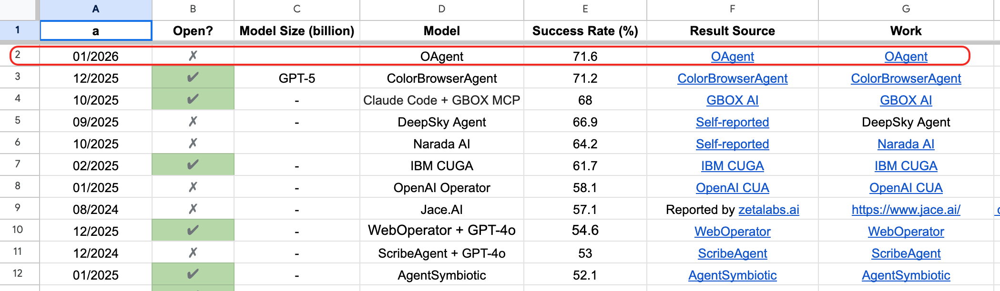

# OAgent 


## Contents
- [News](#news)
- [Introduction](#introduction)
  - [Framework](#1-framework)
  - [Key Modules](#2-key-modules)
  - [Prompt System](#3-prompt-system)
  - [Key Features](#4-key-features)
- [Usage](#usage)
  - [Overview](#overview)
  - [Directory Structure Support](#directory-dtructure-support)
  - [Basic Usage](#basic-usage)
  - [Output Examples](#output-examples)
  - [Data Field Description](#data-field-description)
  

## News
🔥🔥🔥 [2026/01/22] We are pleased to announce that Oagent achieves a remarkable 71.6% resolve rate on the [Webarena](https://webarena.dev/) leaderboard.



## Introduction
This document describes the structure of the demo WebAgent framework implemented in the `./demo/local_agent_eval.py` script. This framework aims to execute and evaluate automated tasks in real Web environments (such as the WebArena Shopping environment) via local/remote model calls.

### 1. Framework 

This Agent adopts a modular **Planner-Grounder-Reflector-Summary** architecture. The entire system consists of a task scheduler, multi-threaded Workers, browser environment management, and core Agent logic.

#### Agent Loop

The execution flow of the Agent is a closed-loop system, mainly containing the following steps:

1.  **Observation**: Acquire the current webpage screenshot.
2.  **Reflector(Gemini3-Pro)**:
    *   Analyzes the execution result of the previous action.
    *   Checks if the task is completed (`is_task_done`).
    *   Collects key information (Notes) to satisfy user requests.
    *   Provides feedback signals to the Planner.
3.  **Planner(Gemini3-Pro)**:
    *   Receives feedback from the Reflector, the current screenshot, and domain expert tips (`tips`).
    *   Generates the next high-level instruction (`instruction`) and action type (`action_type`).
    *   **Expert Strategy**: Dynamically injects expert knowledge and navigation strategies for specific domains (e.g., Adobe Commerce Admin).
4.  **Grounder(PostTraining-Qwen2.5-VL-72B)**:
    *   We collected millions of data points and trained a version of Grounder based on Qwen2.5-VL-72B through post-training (SFT and RL).
    *   Receives instructions and the current screenshot from the Planner.
    *   Uses a Vision Language Model (VLM) to output specific page coordinates (`coords`) or operation parameters.
5.  **Action Execution(Playwright)**:
    *   Executes specific operations (Click, Type, Scroll, Select Option, etc.) via Playwright.
6.  **Summary(Gemini3-Pro)**:
    *   Generates the final answer based on execution history and collected information at the end of the task.

---

### 2. Key Modules

#### 2.1 `LocalWebAgent` Class
The main body of the Agent, responsible for maintaining task status, calling various model modules, and executing the main loop.

*   **State Maintenance**: `steps` (history steps), `marked_notes` (collected info), `last_screenshot`.
*   **Model Calls**:
    *   `call_reflector`: Calls the reasoning model to judge status.
    *   `call_planner`: Calls the reasoning model to generate plans.
    *   `call_grounder`: Calls the visual model (usually an SFT model) to get precise coordinates.
    *   `call_summary`: Generates the final answer.
*   **Strategy Injection**: `get_domain_specific_tips` dynamically loads operation guides for different sites like Shopping/Admin/Map based on the current URL.

#### 2.2 `LocalModelCaller` Class
A unified model call interface encapsulating requests to different backend services:
*   **MatrixLLM / Gemini**: Used for reasoning (Planner/Reflector).
*   **CodeBot / OpenAI SDK**: Used for Grounder (Qwen-VL, etc.).
*   **HTTP**: General HTTP calls.
*   **AFTS Tool Integration**: Automatically handles image uploads, converting Base64 to URLs for specific models.

### 2.3 `BrowserActor` & Distributed Execution
*   **BrowserActor**: Encapsulates the Playwright Browser instance, supporting browser connection management across threads/processes.
*   **Worker**: Multi-threaded workflow, where each Worker binds an ECS instance IP and a Browser Endpoint.
*   **Environment Refresh**: Automatically handles SSH connections, Cookie injection, and ECS website status reset before tasks start.

---


### 3. Prompt System

The framework defines four core Prompt templates guiding different Agent roles:

*   **`REFLECTION_PROMPT`**: Emphasizes "based on observed facts", responsible for verifying task success criteria, detecting infinite loops, and collecting structured data.
*   **`PLANNER_PROMPT`**: Responsible for generating atomic operation instructions. Includes detailed action definitions (scroll, click, type, etc.) and core principles (priority search, table pagination checks, etc.).
*   **`GROUNDER_PROMPT`**: Concise visual instructions requiring the model to output `<tool_call>` or coordinates.
*   **`SUMMARY_PROMPT`**: Responsible for formatting the final answer, handling sorting, counting, and specific format requirements.

---

### 4. Key Features

*   **Robustness Handling**: 
    *   JS fallback mechanism for `select_option` (when Playwright standard selection fails).
    *   Automatic retry mechanism.
*   **Multimodal Support**: Core logic relies heavily on VLM (Visual Language Models) to process webpage visual elements.

---


## Usage

### Overview
`calculate_acc.py` is a Python script for calculating accuracy statistics from WebArena test results. It automatically computes overall accuracy, per-website accuracy, and generates detailed statistical reports.

### Directory Structure Support

The script supports two different result directory structures:

#### 1. Subdirectory Structure (final_visual_results with step-wise screenshots in images)
```
final_visual_results/
├── val_0/
│   └── images
│   └── trajectory.json
├── val_1/
│   └── images
│   └── trajectory.json
└── ...
```

#### 2. Direct JSON Files (final_results)
```
final_results/
├── 0.json
├── 1.json
├── 2.json
└── ...
```

### Basic Usage

Run the script directly:

```bash
python calculate_acc.py
```

The script will automatically process the following directories:
- `./webarena_results/final_visual_results`
- `./webarena_results/final_results`


### Output Examples

#### Console Output

```
================================================================================
PROCESSING FINAL_VISUAL_RESULTS DIRECTORY
================================================================================

============================================================
Sample Accuracy Statistics Report
============================================================
Results Directory: ./webarena_results/final_visual_results
------------------------------------------------------------
Total Samples: 809
Successful Samples: 581
Failed Samples: 228
Accuracy: 71.82%
Accuracy for 812 samples: 0.7155 (581/812)
Average Score: 0.7182
------------------------------------------------------------
Score Distribution:
  Score 0.0: 228 samples (28.18%)
  Score 1.0: 581 samples (71.82%)
------------------------------------------------------------
Statistics by Website:
------------------------------------------------------------

GITLAB (Port: 8023):
  Total Samples: 195
  Successful Samples: 148
  Failed Samples: 47
  Accuracy: 75.9%
  Average Score: 0.759
  Failed Sample Examples: val_102, val_136, val_178

MAP (Port: 3000):
  Total Samples: 112
  Successful Samples: 80
  Failed Samples: 32
  Accuracy: 71.43%
  Average Score: 0.7143
  Failed Sample Examples: val_10, val_140, val_153

REDDIT (Port: 9999):
  Total Samples: 114
  Successful Samples: 98
  Failed Samples: 16
  Accuracy: 85.96%
  Average Score: 0.8596
  Failed Sample Examples: val_28, val_406, val_407

SHOPPING (Port: 7770):
  Total Samples: 191
  Successful Samples: 113
  Failed Samples: 78
  Accuracy: 59.16%
  Average Score: 0.5916
  Failed Sample Examples: val_118, val_124, val_125

SHOPPING_ADMIN (Port: 7780):
  Total Samples: 181
  Successful Samples: 129
  Failed Samples: 52
  Accuracy: 71.27%
  Average Score: 0.7127
  Failed Sample Examples: val_108, val_109, val_111

WIKIPEDIA (Port: 8888):
  Total Samples: 16
  Successful Samples: 13
  Failed Samples: 3
  Accuracy: 81.25%
  Average Score: 0.8125
  Failed Sample Examples: val_265, val_425, val_738
------------------------------------------------------------
============================================================

Detailed results saved to: webarena_results/accuracy_report_visual.json
```

#### JSON Report Output

The script automatically generates two JSON files:
- `webarena_results/accuracy_report_visual.json`
- `webarena_results/accuracy_report_final.json`

JSON files contain complete statistics for further analysis:

```json
{
  "total_samples": 809,
  "successful_samples": 581,
  "failed_samples_count": 228,
  "accuracy": 71.82,
  "average_score": 0.7182,
  "score_distribution": {
    "0.0": 228,
    "1.0": 581
  },
  "site_statistics": {
    "reddit": {
      "port": "9999",
      "total_samples": 114,
      "successful_samples": 98,
      "failed_samples_count": 16,
      "accuracy": 85.96,
      "average_score": 0.8596
    },
    ...
  }
}
```

### Data Field Description

#### trajectory.json Structure

The script extracts the following information from each sample's trajectory.json:

```json
[
  {
    "type": "action",
    "page_url": "http://example.com:7780/...",
    ...
  },
  {
    "configs": {
      "sites": ["shopping_admin"],
      "task_id": 2,
      ...
    }
  },
  {
    "type": "evaluation",
    "score": 0.0 or 1.0
  }
]
```


