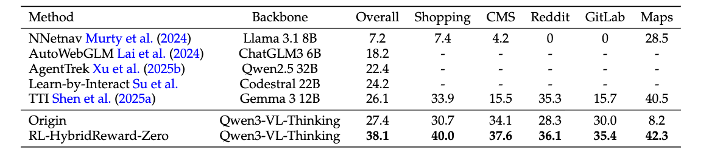

# OpAgent


<p align="center">
    <a href="https://huggingface.co/codefuse-ai/OpAgent-32B">
        
    </a>
    <a href="https://modelscope.cn/models/codefuse-ai/OpAgent-32B">
        
    </a>
    <a href="https://arxiv.org/abs/YOUR_ARXIV_ID"> <!-- TODO: 如果有论文，请替换链接 -->
        
    </a>
</p>

`OpAgent` is a powerful agentic framework designed for autonomous web navigation and operation. It comes in two primary modes to suit different use cases: a full-featured **Agentic Framework** for state-of-the-art performance, and a streamlined **Single-Model Mode** for ease of use and quick deployment.

## Contents
- [News](#news)
- [Overview](#overview)
- [Performance Highlights](#performance-highlights)
- [Getting Started](#getting-started)
- [Detailed Introduction: The Agentic Framework](#detailed-introduction-the-agentic-framework)
  - [Framework Architecture](#1-framework-architecture)
  - [Key Modules](#2-key-modules)
  - [Prompt System](#3-prompt-system)
- [Citation](#citation)

## News
📄📄📄 **[2026/02/14]** We have released our technical report. Please refer to [OpAgent Technical Report](./technical_report/OpAgent.pdf) for details.

🔥🔥🔥 **[2026/01/22]** We are pleased to announce that Opagent achieves a remarkable 71.6% resolve rate on the [Webarena](https://webarena.dev/) leaderboard.

## Overview

This repository provides the code and models for `OpAgent`, an operator agent for web navigation. We offer two distinct modes:

1.  **OpAgent: Single-Model Mode** (`opagent_single_model/` directory)
    *   A simplified, end-to-end approach where a single, powerful Vision-Language Model (VLM) directly performs web navigation tasks.
    *   This mode is designed for accessibility and quick deployment, offering a powerful yet easy-to-use solution for web automation.
    *   Perfect for developers who want to quickly integrate a web agent into their applications.

2.  **OpAgent: The Full Agentic Framework** (`opagent/` directory)
    *   An advanced, multi-agent system composed of a **Planner, Grounder, Reflector, and Summarizer**.
    *   This architecture enables sophisticated reasoning, robust error recovery, and self-correction, achieving top-tier performance on complex, long-horizon web tasks.
    *   Ideal for researchers and users seeking maximum performance and a deep dive into agentic AI architectures.


## Performance Highlights

#### 1. Single-Model Enhancement via Online RL
We employ an innovative **Online Agentic Reinforcement Learning (RL)** pipeline to significantly improve the capability of a single VLM. Our RL-enhanced model (`RL-HybridReward-Zero`) achieves a **38.1%** success rate (@Pass5) on WebArena, outperforming other monolithic baselines and demonstrating a **10.7% absolute improvement** over the original model.


#### 2. Agentic Framework SOTA Performance
Our full agentic framework, OpAgent, achieves a state-of-the-art (SOTA) **71.6%** resolve rate on the WebArena benchmark (formerly OAgent on the WebArena leaderboard), securing the #1 position on the leaderboard on Jan. 2026.


## Getting Started

Depending on which mode you'd like to use, please follow the instructions below.

### 🚀 Mode 1: Single-Model Mode (`opagent_single_model/`)

This mode provides a ready-to-use, interactive web agent powered by a single model. It's the quickest way to see OpAgent in action.

**For detailed installation and usage instructions, please refer to the README in the `opagent_single_model` directory:**

➡️ **[Go to Single-Model Mode Usage Guide](./opagent_single_model/README.md)** ⬅️

A quick preview of how to get started:
```bash
cd opagent_single_model
pip install -r requirements.txt
python main.py
```
---

### 🚀 Mode 1: Agentic Framework (`opagent/`)

This mode utilizes a multi-agent architecture (Planner, Grounder, etc.) to achieve the highest performance.

The core logic is implemented in the `./opagent/` directory, with evaluation scripts located in `./demo/local_agent_eval.py`. This setup is primarily designed for benchmark evaluation and research.

**To run the evaluation:**
```bash
# Detailed setup and execution instructions are work-in-progress.
# Please refer to the code in the 'opagent' and 'demo' directories for now.
# We welcome community contributions to improve the documentation!
```
[**(Learn more about the Agentic Framework's architecture below)↓**](#detailed-introduction-the-agentic-framework)


## Detailed Introduction: The Agentic Framework

This section details the architecture of our high-performance, multi-agent framework.
This document describes the structure of the demo WebAgent framework implemented in the `./opagent/local_agent_eval.py` script. This framework aims to execute and evaluate automated tasks in real Web environments (such as the WebArena Shopping environment) via local/remote model calls.

### 1. Framework 

This Agent adopts a modular **Planner-Grounder-Reflector-Summary** architecture. The entire system consists of a task scheduler, multi-threaded Workers, browser environment management, and core Agent logic.

#### Agent Loop

The execution flow of the Agent is a closed-loop system, mainly containing the following steps:

1.  **Observation**: Acquire the current webpage screenshot.
2.  **Reflector(Gemini3-Pro)**:
    *   Analyzes the execution result of the previous action.
    *   Checks if the task is completed (`is_task_done`).
    *   Collects key information (Notes) to satisfy user requests.
    *   Provides feedback signals to the Planner.
3.  **Planner(Gemini3-Pro)**:
    *   Receives feedback from the Reflector, the current screenshot, and domain expert tips (`tips`).
    *   Generates the next high-level instruction (`instruction`) and action type (`action_type`).
    *   **Expert Strategy**: Dynamically injects expert knowledge and navigation strategies for specific domains (e.g., Adobe Commerce Admin).
4.  **Grounder(PostTraining-Qwen2.5-VL-72B)**:
    *   We collected millions of data points and trained a version of Grounder based on Qwen2.5-VL-72B through post-training (SFT and RL).
    *   Receives instructions and the current screenshot from the Planner.
    *   Uses a Vision Language Model (VLM) to output specific page coordinates (`coords`) or operation parameters.
5.  **Action Execution(Playwright)**:
    *   Executes specific operations (Click, Type, Scroll, Select Option, etc.) via Playwright.
6.  **Summary(Gemini3-Pro)**:
    *   Generates the final answer based on execution history and collected information at the end of the task.

---

### 2. Key Modules

#### 2.1 `LocalWebAgent` Class
The main body of the Agent, responsible for maintaining task status, calling various model modules, and executing the main loop.

*   **State Maintenance**: `steps` (history steps), `marked_notes` (collected info), `last_screenshot`.
*   **Model Calls**:
    *   `call_reflector`: Calls the reasoning model to judge status.
    *   `call_planner`: Calls the reasoning model to generate plans.
    *   `call_grounder`: Calls the visual model (usually an SFT model) to get precise coordinates.
    *   `call_summary`: Generates the final answer.
*   **Strategy Injection**: `get_domain_specific_tips` dynamically loads operation guides for different sites like Shopping/Admin/Map based on the current URL.

#### 2.2 `LocalModelCaller` Class
A unified model call interface encapsulating requests to different backend services:
*   **MatrixLLM / Gemini**: Used for reasoning (Planner/Reflector).
*   **CodeBot / OpenAI SDK**: Used for Grounder (Qwen-VL, etc.).
*   **HTTP**: General HTTP calls.
*   **AFTS Tool Integration**: Automatically handles image uploads, converting Base64 to URLs for specific models.

#### 2.3 `BrowserActor` & Distributed Execution
*   **BrowserActor**: Encapsulates the Playwright Browser instance, supporting browser connection management across threads/processes.
*   **Worker**: Multi-threaded workflow, where each Worker binds an ECS instance IP and a Browser Endpoint.
*   **Environment Refresh**: Automatically handles SSH connections, Cookie injection, and ECS website status reset before tasks start.

---


### 3. Prompt System

The framework defines four core Prompt templates guiding different Agent roles:

*   **`REFLECTION_PROMPT`**: Emphasizes "based on observed facts", responsible for verifying task success criteria, detecting infinite loops, and collecting structured data.
*   **`PLANNER_PROMPT`**: Responsible for generating atomic operation instructions. Includes detailed action definitions (scroll, click, type, etc.) and core principles (priority search, table pagination checks, etc.).
*   **`GROUNDER_PROMPT`**: Concise visual instructions requiring the model to output `<tool_call>` or coordinates.
*   **`SUMMARY_PROMPT`**: Responsible for formatting the final answer, handling sorting, counting, and specific format requirements.

---

### 4. Key Features

*   **Robustness Handling**: 
    *   JS fallback mechanism for `select_option` (when Playwright standard selection fails).
    *   Automatic retry mechanism.
*   **Multimodal Support**: Core logic relies heavily on VLM (Visual Language Models) to process webpage visual elements.
## Citation

If you use OpAgent in your research or project, please cite it as follows:

```bibtex
@misc{opagent2026,
  author = {CodeFuse-AI Team},
  title = {OpAgent: Operator Agent for Web Navigation},
  year = {2026},
  publisher = {GitHub},
  howpublished = {\url{https://github.com/codefuse-ai/OpAgent}},
  url = {https://github.com/codefuse-ai/OpAgent}
}
```
